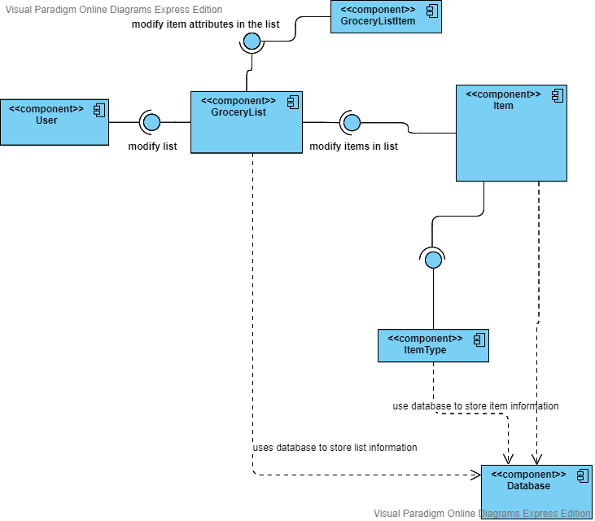
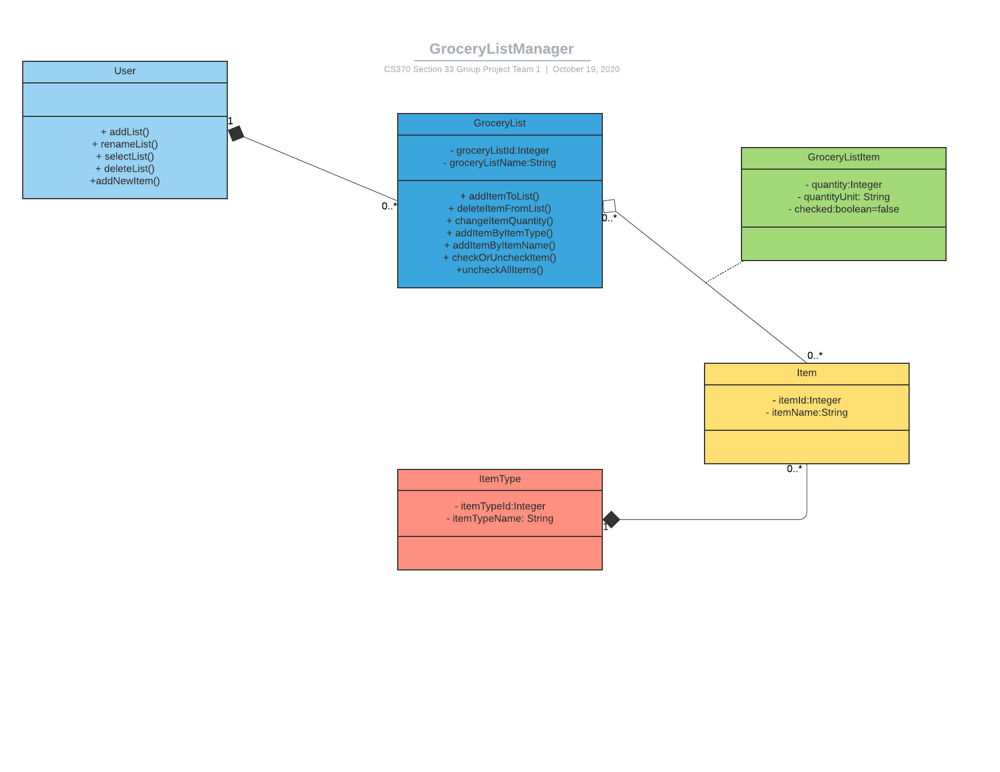
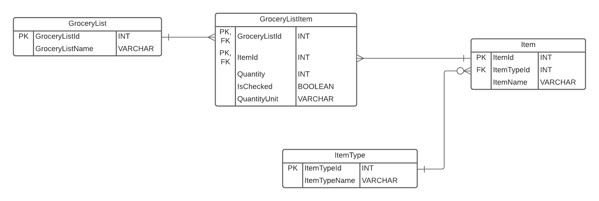

# Design Document

*This is the template for your design document. The parts in italics are concise explanations of what should go in the corresponding sections and should not appear in the final document.*

**Author**: Jeffrey Tom, Xin Huang Liu, revised by Shmuel Halbfinger

## 1 Design Considerations

In this section, we discuss the Assumptions, constraints, and system environment related to somebody using our application. This includes assumptions about the system specs of the user's device, the software constraints, and the environment the application needs to run effectively.

### 1.1 Assumptions
The user will require a mobile device to be in portrait mode. A connection to the internet is not required, since every process that the app runs is self-contained. The device required will need to be running at least Android API 21 (Lollipop). It is also assumed that the user has sufficient space to install the application on their phone. The data that the application will use will be stored in a self-contained SQLite database, further limiting internet connectivity requirements.

### 1.2 Constraints
The user will not be able to access their list from different devices such as desktop or other mobile devices. This is because there are no accounts linking a User to their lists, and because the database, implemented with SQLite, is self-contained and persists only within the specific system.

The user must have enough space on their device to ensure the application is installed. This includes having enough RAM in order to run the system. In addition, the user may have an active internet connection at the time.

### 1.3 System Environment

This application will only run on Android Devices with at least an API Level 21. The application will only be able to install if there is enough storage on the phone, and there must be an active connection to the Internet in order to install the app from the play store.

## 2 Architectural Design

The architecture provides the high-level design view of a system and provides a basis for more detailed design work. These subsections describe the top-level components of the system that we are building and their relationships.

### 2.1 Component Diagram

The component diagram lists the 5 main components contained in our application, and how they interact with each other. We also showed interactions between some of our elements and our database, and we documented descriptions of those relationships. 

### 2.2 Deployment Diagram

Our project only works on one device and the software itself at a time (at least for now. Future implementations may be able to support adding accounts with a central database and deployment on servers). In other words, our project is working locally and the only connection is the database. This database is embedded within the device, and it is not hosted online or on a different device. Therefore, we concluded that the documentation doesn't require a deployment diagram as of now. 

## 3 Low-Level Design

Here, we describe the low-level design for each of the system components identified in the previous section. For each component, we provide details in the following UML diagrams to show its internal structure.

### 3.1 Class Diagram

In the case of an OO design, the internal structure of a software component would typically be expressed as a UML class diagram that represents the static class structure for the component and their relationships. We used the class diagram developed during the inception phase of the Unified Software Process that we followed.

### 3.2 Other Diagrams

##### Entity-Relationship Diagram

We included an entity-relationship diagram in order to show how our classes represent concrete data which the user will be able to interact with. It was also helpful for team members to reference when working on database implementation.

## 4 User Interface Design
When initially making these mockups, we hadn't yet started on the implementation of the UI. Therefore, these mockups are simply UI representations of the functionality that we want to implement, but the actual user interface might change as the project evolves.

##### Landing Page

This mockup represents a (potential) landing page with the name of the application.

##### Grocery Lists

This page shows the list of Grocery Lists created by the user. The user can create a new list by pressing the **+** icon, rename or delete a list, and select one of the lists.

##### Create new list

This page shows how the user can enter the name of a new list and create it.

##### List of Items

This is the main page showing a list of items that the user has. It has the name of the item, its quantity, a unit type if one was included, and a check box that can be checked or unchecked by the user. A user can also add an item and change the unit type by pressing the + icon. They can also uncheck all items, group items by item type, remove an item, or edit an item.

##### List of Items Grouped By Item Type

This page has the list of items, but they are grouped by list. The same functionality for the regular list page persists.

##### Add item by Item type

This page shows how a user can add an item by the item type. The user can select an item type and it will list the items under that item type. Then, the item can be added using the **+** icon next to the item name.

##### Add item by Item name

This page shows how an item can be added by typing the item name

##### Add item to Database

This page shows that if an item is not found in the database, then a button to add a new item will appear. The user can then press this button, leading them to a page to add an item to the database by selecting the item type and then adding an item name.

