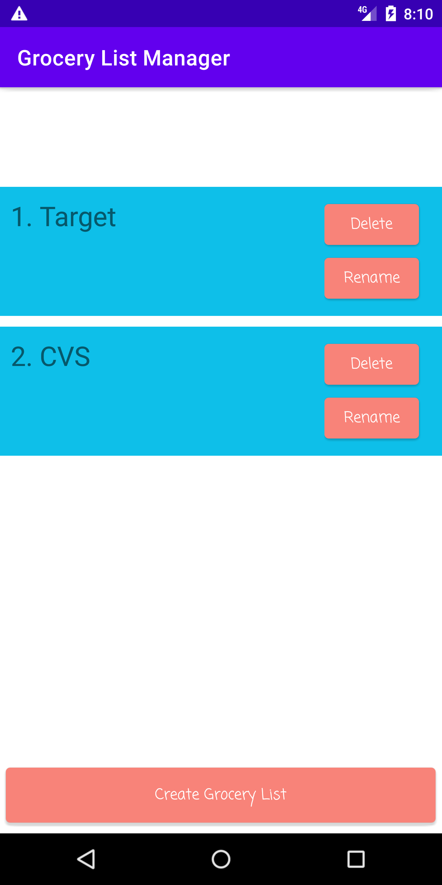
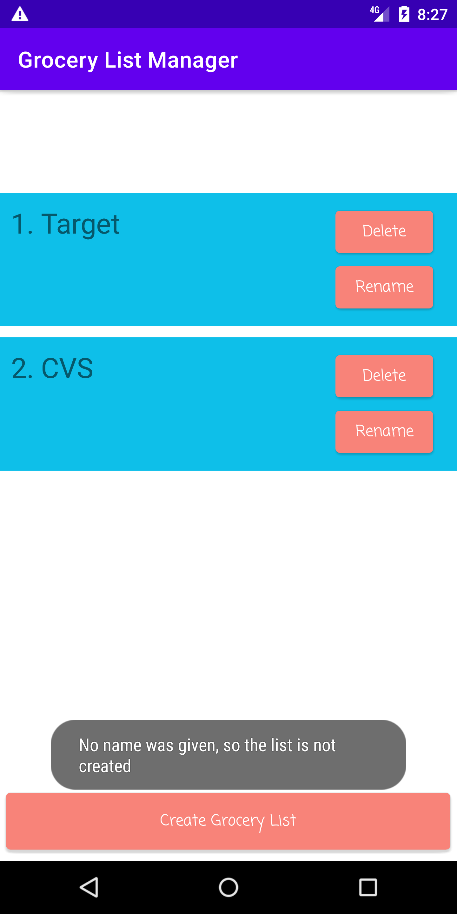
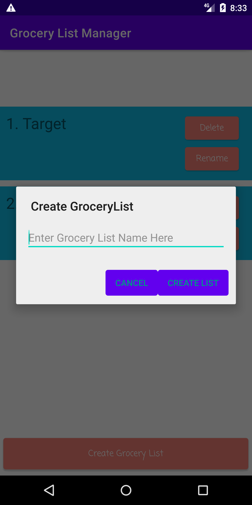
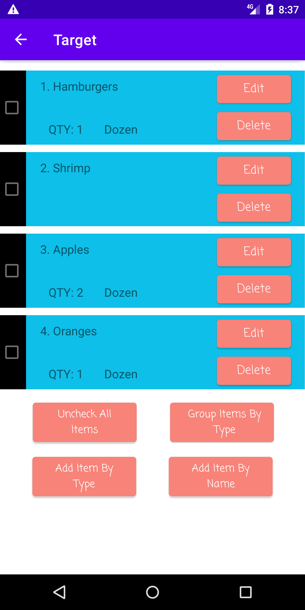
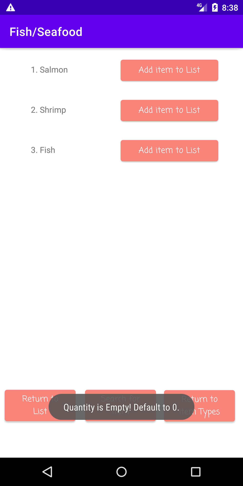
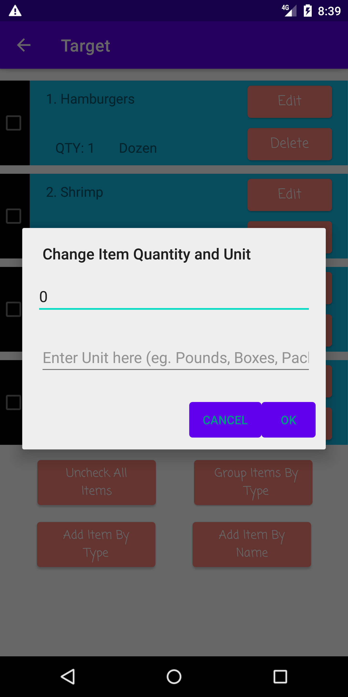
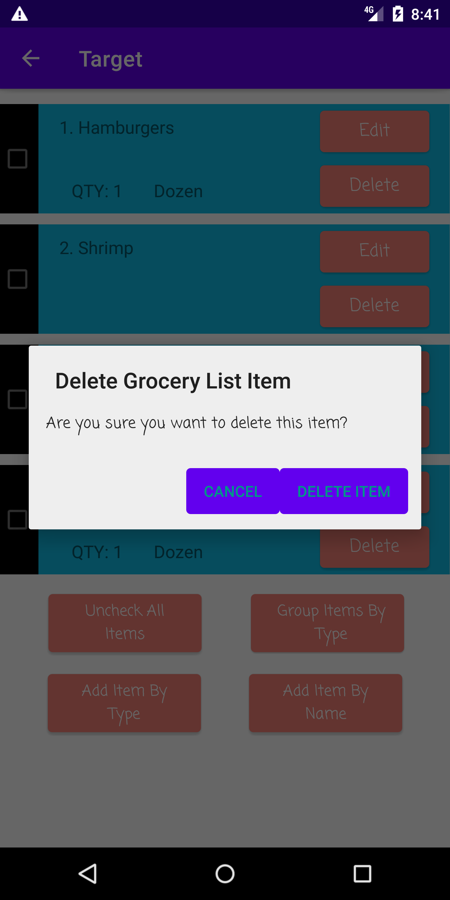
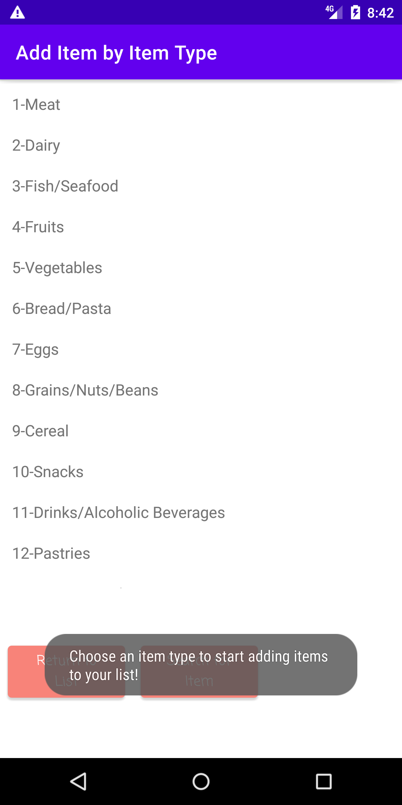
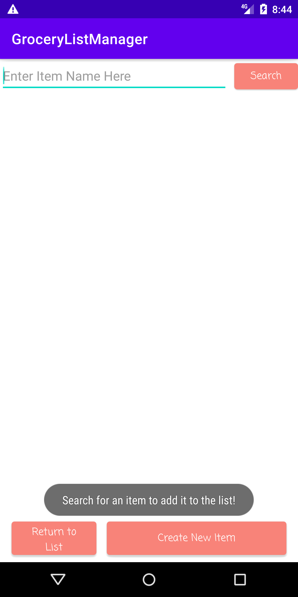

# User Manual for the Grocery List Manager App

Welcome to the Grocery List Manager App! We hope that our application will make shopping for groceries much easier and much more fun! Below is a detailed list of steps for how to utilize our application. We have split the list of instructions up by the screen the user will see. We will include pictures to demonstrate the functionality of the application. These pictures are taken from an emulator using the screenshot functionality, and are not markups. Therefore, they represent the actual User Interface for the application (**Note: Although there may have been changes made to the User Interface after these screenshots were taken, these changes will not affect the layout of the application so much that these screenshots are useless. The changes would only be small textual changes)**.

### Main Activity

On this screen the user will see a list of their created Grocery Lists. If you either don't have a list or would like to create a new list, you can click on the **Create Grocery List** button, which will open a mini screen that will allow you to enter the name of that list. After you create the list, it will automatically appear in your list of Grocery Lists.

Each Grocery list gives you the option to delete, rename, or select that list. If you choose to rename or delete the list, a mini screen will open prompting you to complete the selected action. If you press on the name of the list, the list will be selected and you will be taken to the List Activity screen.

<table>
	<tr>
		<th></th>
		<th></th>
		<th></th>
	</tr>
	<tr>
		<th></th>
		<th></th>
	</tr>
</table>

### List Activity

This screen shows the Items in the user's selected Grocery List. Each item consists of:

- A check box that can be checked or unchecked depending on whether or not you have already acquired the Item
- Number of the item in the list and the name of the Item (Ex- "1. Apples")

<table>
	<tr>
		<th></th>
	</tr>
</table>

- Quantity of the Item
  - if the quantity is not specified, this will remain empty
- Unit Type of the item (i.e. bags, dozens, grams, pounds, boxes, etc. This can also be empty if the Item is bought individually!! It is completely your choice)
  - If the unit type is not specified, this will remain empty

<table>
	<tr>
		<th></th>
		<th></th>
	</tr>
</table>

- Button to Edit the Item
  - Upon pressing this button, a pop-up dialog box will appear with areas to edit the quantity and the unit. Then, the user presses the "Edit Item" button and the item will update

<table>
	<tr>
		<th></th>
	</tr>
</table>

- Button to Delete the Item
  - Upon pressing this button, a popup-dialog button will appear, asking the user if they are sure that they would like to complete this action. Upon pressing the "Delete item" button, the item will be deleted and will disappear from the list.

<table>
	<tr>
		<th></th>
	</tr>
</table>

On the bottom of the screen are an assortment of buttons which perform the following actions

- **Add Item by Item Type**: takes you to the screen where you can add an item by first specifying the item type. This button will take you to the Add Item by Item Type Activity screen.

<table>
	<tr>
		<th></th>
	</tr>
</table>

- **Add Item By Name**: takes you to a screen where you can add an item by searching its name. This button will take you to the Add Item by Name Activity screen.

<table>
	<tr>
		<th></th>
	</tr>
</table>

- **Uncheck All Items**: Allows you to uncheck all of the Items, in case many items were accidentally clicked or you want to start over

<table>
	<tr>
		<th></th>
		<th></th>
	</tr>
</table>

- **Group Item by Item Type**: Allows you to group the items by item type. This means that the items in the list will appear in the order of their item type, so you can easily shop for the same item type without having to go up and down the list. Each item's name will be formatted as "<Item-Type\>**:**<Item-Name\>", while the quantity and unit type will remain the same.

<table>
	<tr>
		<th></th>
	</tr>
</table>

### Add Item By Item Type Activity

This screen allows you to add an item to your list. First, you select an item type from a list of item types. Then, upon clicking on the name of an item type, the list of items that fall under that item type will appear with buttons allowing you to add them to your list. Upon clicking a button next to an Item's name, a mini screen will appear prompting you to enter a quantity and a unit type and add the item to the list. You will then be taken back to the screen with your list.

<table>
	<tr>
		<th></th>
		<th></th>
		<th></th>
	</tr>
    <strong>Note: Now the Name of the Item is at the top of the "Add Item" Dialog Box</strong> 
	<tr>
		<th></th>
		<th></th>
	</tr>
</table>

**You may leave the quantity and unit type blank, and they can be edited in the List Activity Screen**

After you select an item type, a button will appear that allows you to return to the item type in case you selected the wrong one. There is also a button that allows you to search for an item to add, which will take you to the Add Item by Name Activity screen.

<table>
	<tr>
		<th></th>
	</tr>
</table>

**Note: If an item already exists in your list, it can't be added again. If you try to add the same item multiple times, with different quantities and/or unit types, only the first version you added will appear in your grocery list. If you wish to edit the quantity and/or unit type, please do so in the List Activity screen.**

### Add Item by Name Activity

This screen allows the user to search for an item. If that item isn't found, the user can specify the item type and that item will be added and can be added to a list. Any item that matches the search will be listed, along with a button that can be used to add that item to the list.

<table>
	<tr>
		<th></th>
	</tr>
</table>

Upon entering the screen, the user can enter the name of an item they would like to add. The following 2 scenarios can occur:

1. No item is shown

If this occurs, a popup dialog box will open, where the user will be asked if they would like to add the item that was searched for. If the user selects "yes", then they are brought to the Create New Item Screen, where they can choose an item type for the item. If they select "no", the dialog box will close and the user can search for a new item.

<table>
	<tr>
		<th></th>
		<th></th>
	</tr>
</table>

2. A list of items with names similar to the search query are listed

If the user finds an item he wants to add, he can click on the button next to the item. A dialog box will pop up prompting the user to enter a quantity and unit type. **As with other screens, entering the quantity and unit type are optional and they can be left blank**.

<table>
	<tr>
		<th></th>
        <th></th>
        <strong>Note: Now the Name of the Item is at the top of the "Add Item" Dialog Box</strong> 
	</tr>
</table>

If the user doesn't find an item he likes, there is a button to create a new item. If no item was searched for, this will take the user straight to the Create New Item Activity Screen. If an item was searched for, a dialog box will appear prompting the user to decide if they would like to add the item that was searched for or add an item from scratch. If they choose to add from scratch, the Create New Item Activity will open, allowing the user to choose an item type and specify an item name. If they choose to add the searched-for item, the Create New Item Activity will open prompting the User to choose an item type for this new item.

<table>
	<tr>
		<th></th>
	</tr>
</table>

There is also a button to return to the List Activity screen.

### Create New Item Activity

This screen allows you to add a new item in case an item that you want to add to your list is not present. There are 2 scenarios in which this screen will be opened:

1. The user searched for an item and it was not found 

The screen will prompt you to choose an item type for the item you had searched for from a list of item types. Upon pressing on an item type, the item will be added and the user can search for it.

<table>
	<tr>
		<th></th>
		<th></th>
	</tr>
</table>

<table>
	<tr>
		<th></th>
	</tr>
</table>

2. The user wants to add a new item from scratch, i.e. without first searching for it

A list of item types will appear. Upon clicking the name of an item type, a pop-up dialog screen will appear prompting you to enter the name of the Item you wish to create. The user can then enter the item name and the item will be added.

<table>
	<tr>
		<th></th>
		<th></th>
		<th></th>
	</tr>
</table>

**Note:  If the specified item already exists for the selected item type, a popup message will appear telling the user that the item with that item type had already been added, and the user will be sent back to the Add Item By Name Activity screen** 

<table>
	<tr>
		<th></th>
		<th></th>
	</tr>
</table>

Upon completing either of these scenarios, you will be taken back to the Add Item By Name Activity, where you can now search for the new item and any other existing items.

<table>
	<tr>
		<th></th>
	</tr>
</table>

There is also a button to return to the List Activity Screen.

<table>
	<tr>
		<th></th>
	</tr>
</table>
